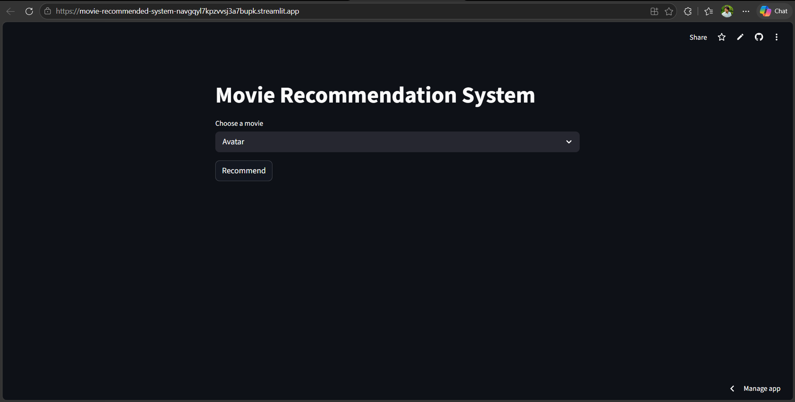
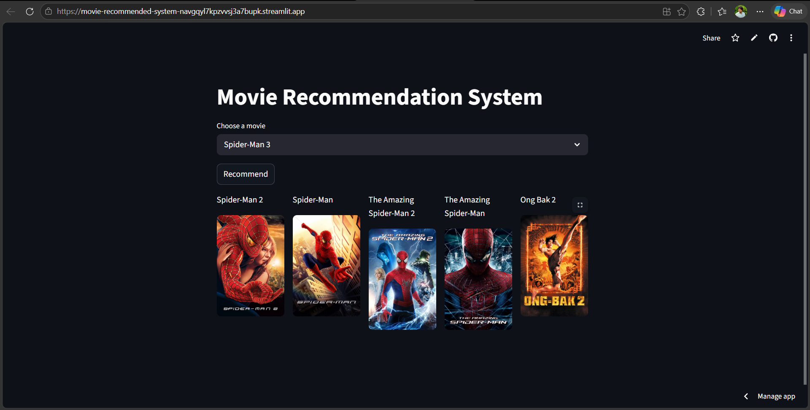

🎬 Movie Recommendation System

A Machine Learning-based Movie Recommendation System that suggests similar movies based on user input using content-based filtering techniques. The project uses NLP and similarity algorithms to recommend movies with similar genres, keywords, cast, and overview.

📌 Project Overview

This project recommends movies similar to the one selected by the user. It uses machine learning and natural language processing techniques to analyze movie metadata and compute similarity scores.

The recommendation engine is built using:

Content-Based Filtering
Cosine Similarity
Text Vectorization
NLP preprocessing
🚀 Features
Search movies instantly
Get top recommended similar movies
Content-based recommendation system
Machine Learning powered suggestions
User-friendly interface
Fast recommendation generation
🛠️ Tech Stack
Python
Pandas
NumPy
Scikit-learn
Streamlit / Flask (whichever you used)
VS Code
Jupyter Notebook
📂 Dataset

The project uses the TMDB Movie Dataset containing:

Movie titles
Genres
Cast
Crew
Keywords
Overview

Dataset Source:

TMDB Movie Dataset
⚙️ Machine Learning Concepts Used
Data Preprocessing
Feature Engineering
CountVectorizer / TF-IDF
Cosine Similarity
Recommendation Algorithms
NLP Techniques
📁 Project Structure
Movie-Recommended-System/
│
├── data/
│   ├── movies.csv
│   └── credits.csv
│
├── model/
│   ├── similarity.pkl
│   └── movie_list.pkl
│
├── app.py
├── recommendation.ipynb
├── requirements.txt
├── README.md
└── assets/
🔧 Installation

Clone the repository:

git clone https://github.com/Devender-Mathela/Movie-Recommended-System.git

Move into the project directory:

cd Movie-Recommended-System

Install dependencies:

pip install -r requirements.txt
▶️ Run the Project

If using Streamlit:

streamlit run app.py

If using Flask:

python app.py
💡 How It Works
Load movie dataset
Clean and preprocess data
Combine important movie features
Convert text data into vectors
Calculate cosine similarity
Recommend similar movies
📊 Recommendation Workflow
User selects movie
        ↓
Feature extraction
        ↓
Text vectorization
        ↓
Cosine similarity calculation
        ↓
Top similar movies recommended
🎯 Results
Successfully recommends similar movies
Fast and efficient recommendation generation
Uses NLP techniques for better matching
Improved understanding of recommendation systems
📸 Screenshots

Home Page

Recommendation Output

📚 Learning Outcomes

Through this project, I learned:

Recommendation system concepts
NLP preprocessing
Feature engineering
Cosine similarity implementation
Machine learning workflow
Model serialization using Pickle
🔮 Future Improvements
Add collaborative filtering
Deploy on cloud platforms
Add movie posters using TMDB API
Improve recommendation accuracy
Add user authentication system
👨‍💻 Author

Deepu Mathela

GitHub: Devender-Mathela GitHub
📄 License

This project is licensed under the MIT License.

Project Repository: Movie-Recommended-System Repository

Based on common recommendation-system techniques and GitHub project structures.
